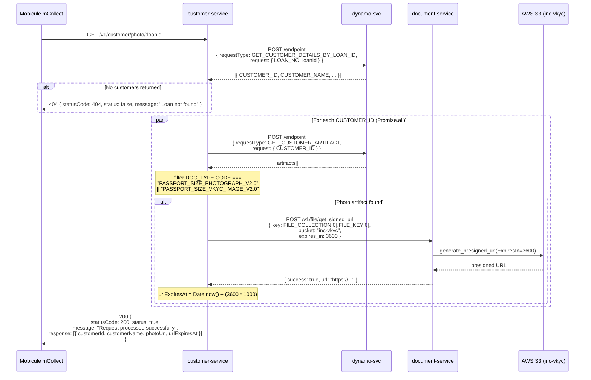

# PLAN.md — MM-Epic-1-Story-1A
Epic: MM-Epic-1
Branch: feat/MM-Epic-1_CustomerPhotoAPI
Generated: 2026-06-25
Status: PENDING APPROVAL

---

## SECTION 1: PM BUSINESS SCOPE

### Story Summary
Mobicule's mCollect app needs customer photos before doorstep visits. This
story delivers an internal REST endpoint on customer-service that accepts a
loan ID, finds all customers on that loan, and returns an array of
{ customerId, customerName, photoUrl, urlExpiresAt } — where photoUrl is a
time-limited pre-signed S3 URL (default 1 hour TTL, configurable). Only
customers who have a verified photo (DOC_TYPE PASSPORT_SIZE_PHOTOGRAPH_V2.0
or PASSPORT_SIZE_VKYC_IMAGE_V2.0) appear in the response. No API key
authentication — this is an internal endpoint within the cluster.

### Acceptance Criteria (Binding)
1. Endpoint accepts a loanId and returns an array of customer photo records
2. Each record contains: customerId, customerName, photoUrl, urlExpiresAt
3. photoUrl is a pre-signed S3 URL valid for 1 hour (TTL configurable via
   customerPhotoApi.presignedUrlTtlSeconds — default 3600 seconds)
4. urlExpiresAt is a Unix epoch in milliseconds = Date.now() + (ttlSeconds * 1000)
5. Only customers with a matching photo artifact appear in the response
   (customers with no photo are silently omitted)
6. Photo match uses DOC_TYPE.CODE:
   PASSPORT_SIZE_PHOTOGRAPH_V2.0 or PASSPORT_SIZE_VKYC_IMAGE_V2.0
7. Requests missing loanId return HTTP 400 with service-standard error shape
8. Requests with an invalid loanId format (empty string) return HTTP 400
9. When loanId has no customers: HTTP 404 with service-standard error shape
10. When all customers have no matching photo: return HTTP 200 with empty
    response array []
11. All responses (success and error) follow service-standard shape:
    { statusCode, status, message, response? } — camelCase, no custom
    error_code field
12. Full response for a 2-customer loan completes within 3 seconds p95

### Out of Scope
- API key or token authentication (internal endpoint)
- Returning raw image bytes (pre-signed URL only, no base64 payload)
- Writing or updating customer photo records
- Rate limiting or throttling
- Paginating results
- Any change to existing /v1 or /v2 customer-service routes

### Business Edge Cases
- Loan has 1 applicant + 1 co-applicant, both have photos → 2 items returned
- Loan has 2 customers, only 1 has a photo → 1 item returned (no error)
- Loan has 2 customers, neither has a photo → empty array [] (HTTP 200)
- Extra unknown query params → silently ignored
- Empty string loanId → HTTP 400
- S3 presigned URL generation fails for one customer → omit that customer and
  continue (partial success is acceptable for mCollect UX)

### Demo Gate
- **Validators:** Ansuman Mishra (Sr. QA)
- **Dataset:** 1 loan with 2 customers both having photos, 1 loan where no
  customer has a photo (empty array), 1 nonexistent loanId (404), 1 missing
  loanId (400)
- **Pass Criteria:** multi-customer loan returns 2 records with valid photoUrls
  loadable in browser; urlExpiresAt is epoch ms ≈ now + 3600000; p95 under 3
  seconds; empty-photo loan returns []; error shapes follow service standard

---

## SECTION 2: TECHNICAL/CODE CHANGES

### Services in Scope
| Service          | Type                              | Change Type                              |
|------------------|-----------------------------------|------------------------------------------|
| customer-service | Microservice (TypeScript/Express) | Add — new route, controller, service     |
| document-service | Microservice (Python/Flask)       | Modify — add optional expires_in to presigned URL endpoint |

dynamo-svc has no code changes — called via existing requestType pattern.

### Interface Changes
| Interface                      | Current Behaviour                  | New Behaviour                                       | Consumers Affected               |
|--------------------------------|------------------------------------|-----------------------------------------------------|----------------------------------|
| GET /v1/customer/photo/:loanId | Does not exist                     | Returns array of { customerId, customerName, photoUrl, urlExpiresAt } | Mobicule mCollect (new) |
| POST /v1/file/get_signed_url   | ExpiresIn hardcoded to max_expiry  | Accepts optional expires_in (seconds); falls back to max_expiry if absent | customer-service (new), all existing callers unaffected |
| DocumentClientService          | getZipFileBuffer, uploadToS3 only  | + getPresignedUrl(key, bucket, ttlSeconds) added    | Only CustomerPhotoService        |

Route follows existing /v1/customer/:id convention. Adjust path during
implementation if service pattern dictates differently — Section 1 ACs are
binding, exact path is not.

### Sequence Diagram



### Call Chain Impact

```
Mobicule mCollect (internal cluster call)
  GET /v1/customer/photo/:loanId

  ↓ Step 1 — resolve customers for this loan
  dynamo-svc POST /endpoint
  { requestType: "GET_CUSTOMER_DETAILS_BY_LOAN_ID",
    request: { LOAN_NO: loanId } }           ← key is LOAN_NO, not LOAN_ID
  → [] → 404 { status: false, message: "Loan not found" }
  → [{ CUSTOMER_ID, CUSTOMER_NAME, PRIMARY_PHONE, CUSTOMER_EMAIL, STATE }]

  RESOLVED: response includes CUSTOMER_NAME directly (SQL join on gcd_customer_m
  + cr_loan_dtl). No separate CUSTOMER_GET call needed.
  customerName = record.CUSTOMER_NAME

  ↓ Step 2 — parallel for each CUSTOMER_ID (Promise.all)
  dynamo-svc POST /endpoint
  { requestType: "GET_CUSTOMER_ARTIFACT",
    request: { CUSTOMER_ID: customerId } }
  → filter: DOC_TYPE.CODE === "PASSPORT_SIZE_PHOTOGRAPH_V2.0"
         || DOC_TYPE.CODE === "PASSPORT_SIZE_VKYC_IMAGE_V2.0"
  → no match → omit this customer (not an error)

  FILE_KEY: artifact.FILE_COLLECTION[0].FILE_KEY[0]   ← FILE_KEY is an array

  ↓ Step 3 — for each customer with a photo
  document-service POST /v1/file/get_signed_url
  { key: FILE_KEY[0], bucket: "inc-vkyc",
    expires_in: config.get("customerPhotoApi.presignedUrlTtlSeconds") }
  → success: true → photoUrl = response.url
  → failure → log error, omit customer, continue

  urlExpiresAt = Date.now() + (ttlSeconds * 1000)   ← epoch ms

  ↓ Response: HTTP 200
  {
    statusCode: 200,
    status: true,
    message: "Request processed successfully",
    response: [
      {
        customerId: "3504411239671016C",
        customerName: "John Doe",
        photoUrl: "https://s3.ap-south-1.amazonaws.com/inc-vkyc/...",
        urlExpiresAt: 1751862000000
      }
    ]
  }
```

Source: SERVICE-KB § 4.1 (dynamo-svc), customer-service config/preprod.json
(config structure), src/services/customerApplicationsListService.ts
(existing parallel Promise.all pattern), src/services/customerDocumentsService.ts
(GET_CUSTOMER_ARTIFACT), artifact structure confirmed by Aryan 2026-06-25

### document-service Change — Minimum Effort TTL Support

Current behaviour: `GET /v1/file/get_signed_url` ignores any TTL input;
always uses `config_manager.get_timeouts()["max_expiry"]` (currently 3600s default).

Two-line change — no existing callers are affected:

**api/utils/schema.py** — add one optional field to `GetSignedUrlSchema`:
```python
class GetSignedUrlSchema(Schema):
    bucket = fields.String(required=True, allow_none=False)
    key = fields.String(required=True)
    action = fields.String(validate=validate.OneOf(["view", "download"]), required=False)
    expires_in = fields.Integer(required=False, load_default=None)  # ADD THIS LINE
```

**api/service/file_service.py** — use expires_in if provided, else fall back:
```python
# BEFORE
ExpiresIn=config_manager.get_timeouts()["max_expiry"],

# AFTER
ExpiresIn=request.json.get("expires_in") or config_manager.get_timeouts()["max_expiry"],
```

Existing callers that omit `expires_in` continue to receive the default TTL.
No schema validation errors — field is optional with `load_default=None`.

### Reusable Modules
| Module | Path | Reuse Type |
|--------|------|------------|
| DynamoDB proxy | src/services/dynamoService.ts → makeDynamoDBRequest() | REUSE — no body changes |
| Parallel pattern | src/services/customerApplicationsListService.ts → Promise.all pattern | REUSE as reference |
| Doc client service | src/services/documentClientService.ts | PARTIAL-REUSE — add getPresignedUrl() following existing makeHttpRequest pattern |
| Response formatter | src/utils/responseMaster.ts → appResponse() / handleResponse() | REUSE — no body changes |
| HTTP wrapper | src/services/commonConnectionService.ts → makeHttpRequest() | REUSE — no body changes |

### Files to Create / Modify / Delete

**customer-service:**
| Action | File Path | Reason |
|--------|-----------|--------|
| CREATE | src/controllers/customerPhotoController.ts | Handler for GET /v1/customer/photo/:loanId |
| CREATE | src/services/customerPhotoService.ts | Orchestrates loan lookup → artifact filter → presigned URL |
| CREATE | src/validations/customerPhotoValidator.ts | Joi/express-validator schema for loanId path param |
| CREATE | test/customerPhoto.test.ts | Unit + integration tests (Section 3) |
| MODIFY | src/services/documentClientService.ts | Add getPresignedUrl(key, bucket, ttlSeconds) method |
| MODIFY | src/routes/index.ts | Register GET /v1/customer/photo/:loanId |
| MODIFY | src/controllers/index.ts | Export CustomerPhotoControllerInstance |
| MODIFY | config/preprod.json | Add "customerPhotoApi": { "presignedUrlTtlSeconds": 3600 } |
| MODIFY | config/default.json | Add "customerPhotoApi": { "presignedUrlTtlSeconds": 3600 } |

**document-service:**
| Action | File Path | Reason |
|--------|-----------|--------|
| MODIFY | api/utils/schema.py | Add expires_in optional int field to GetSignedUrlSchema |
| MODIFY | api/service/file_service.py | Use expires_in if provided, else fall back to max_expiry |

### Complexity Notes
- Cyclomatic complexity: Medium
- Parallel dynamo calls (Step 2) — use Promise.all following
  customerApplicationsListService.ts getApplicationUsingUCID pattern
- FILE_KEY is an array: use `artifact.FILE_COLLECTION[0].FILE_KEY[0]`
- Partial success: presigned URL failure for one customer → log + omit + continue
- RESOLVE-IN-PLAN-1 is the only remaining open item — resolve before writing
  integration tests in Phase 3

---

## SECTION 3: MULTI-SERVICE QA SCENARIOS

### Unit Test Scenarios
| Scenario | Input | Expected Output | Edge Case? |
|----------|-------|-----------------|------------|
| Loan with 2 customers, both have photos | loanId=APP001 | HTTP 200, response array length 2, photoUrl non-empty, urlExpiresAt ≈ Date.now()+3600000 | N |
| Loan with 1 customer having photo | loanId=APP002 | HTTP 200, response array length 1 | N |
| Loan found, no customer has photo | loanId=APP003 | HTTP 200, response: [] | Y |
| Loan not found | loanId=UNKNOWN | HTTP 404, status: false | N |
| Missing loanId param | path with no id | HTTP 400, status: false | N |
| Empty string loanId | loanId= | HTTP 400, status: false | Y |
| Presigned URL fails for 1 of 2 customers | loanId=APP004 | HTTP 200, response array length 1 | Y |
| Extra unknown query params | loanId=APP001&foo=bar | HTTP 200, normal response | Y |
| DOC_TYPE is PASSPORT_SIZE_PHOTOGRAPH_V2.0 | artifact with that code | customer included in response | N |
| DOC_TYPE is PASSPORT_SIZE_VKYC_IMAGE_V2.0 | artifact with that code | customer included in response | N |
| DOC_TYPE is any other value | artifact with other code | customer omitted from response | Y |

### Integration Test Scenarios
| Scenario | Services Involved | Expected Behaviour | p95 Latency Target |
|----------|------------------|--------------------|--------------------|
| Full retrieval — 2-customer loan | customer-service → dynamo-svc → document-service | HTTP 200, 2 records, photoUrls valid and loadable | <3000ms |
| Loan not found | customer-service → dynamo-svc | HTTP 404 | <500ms |
| Loan found, no photos | customer-service → dynamo-svc | HTTP 200 [] | <500ms |

### Regression Scenarios
Existing behaviours that must not break:
- GET /v1/customer/documents/:id — response shape unchanged
- GET /v2/customer/documents/:id — response shape unchanged
- GET /v2/customer/artifacts/:id — GET_CUSTOMER_ARTIFACT with MASK unchanged
- document-service POST /v1/file/get_signed_url called without expires_in —
  continues to use max_expiry (3600s default), no behaviour change
- document-service POST /v1/file/get_signed_url_no_expiry — unchanged
- GET /metrics on both services — Prometheus endpoint accessible

### Golden Data for AI-Assisted Testing
(For Phase 3 — concrete values to feed to jest mocks)

Happy path (customer with VKYC photo):
  loanId = "4624411239671012A"
  GET_CUSTOMER_DETAILS_BY_LOAN_ID returns [{ CUSTOMER_ID: "3504411239671016C", CUSTOMER_NAME: "John Doe", ... }]
  GET_CUSTOMER_ARTIFACT returns artifact:
    DOC_TYPE.CODE = "PASSPORT_SIZE_VKYC_IMAGE_V2.0"
    FILE_COLLECTION[0].FILE_KEY[0] = "c8724aa695066911d75e2055114ec304/c0f3be9749aab03c0a13a9207e5e791e"
    FILE_NAME = "vkycFaceImage.jpg"
  document-service get_signed_url returns: { success: true, url: "https://s3.ap-south-1.amazonaws.com/inc-vkyc/..." }
  Expected: HTTP 200, photoUrl non-empty, urlExpiresAt = Date.now() + 3600000 ±5000ms

DOC_TYPE mismatch (no photo):
  GET_CUSTOMER_ARTIFACT returns artifact with DOC_TYPE.CODE = "PAN_CARD_V2.0"
  Expected: customer omitted, response: []

Loan not found:
  GET_CUSTOMER_DETAILS_BY_LOAN_ID returns null or []
  Expected: HTTP 404 { statusCode: 404, status: false, message: "Loan not found" }

---

## IMPLEMENTATION INFO

Base Branch:    preprod
Story Branch:   feat/MM-Epic-1_CustomerPhotoAPI
Test Command:   npm run test
QA Envs:        TBD — confirm with Sunil Kumar (Tech Lead)
Primary Owner:  Aryan Maurya

---

## APPROVAL GATE

This PLAN.md must be approved by both reviewers before Phase 3 (TDD) begins.

| Reviewer      | Role                                | Status      |
|---------------|-------------------------------------|-------------|
| Souvik Nayek  | Business scope sign-off (Sec 1)     | ⏳ Pending  |
| Sunil Kumar   | Technical approach sign-off (Sec 2) | ⏳ Pending  |
